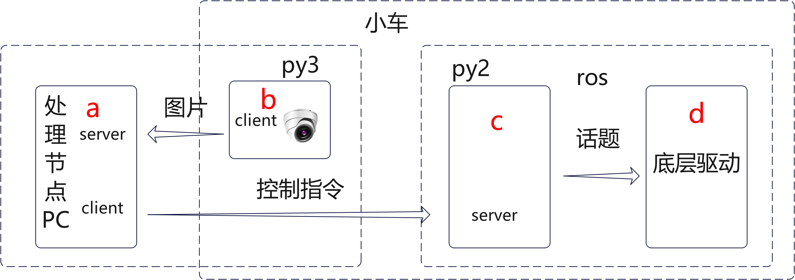

# 无人小车目标跟随系统


## 1、介绍

### 概述

本项目是将**yolo5的目标识别系统**和**ros无人小车**结合形成的无人小车目标跟随系统，其原理是是无人小车通过相机获取图片，送给yolo5进行处理，识别图中目标的位置，经过计算，决定小车如何运动，发送控制指令给小车，完成跟随效果！

### 图解





如图所示，本项目主要有4大程序，图中标红的abcd，其中，程序d是ros小车自带的，我们编写的主要是程序abc，下面按照顺序来讲解

首先是**程序b**，通过opencv从相机获取实时图片，通过UDP发送给程序a处理

**程序a**是驱动yolo5的程序，也是本项目最重要的程序，获取到程序b的图片后，先经过yolo5判断图片中的目标框（由于是目标跟随，事先已经让yolo5只识别人体，不识别其他物体），图片中可能有多个目标框，会从中选择一个作为需要跟随的目标，（至于怎么选，可以看程序，也可以用先进的算法改进），有了目标，判断目标和小车的距离和方位，决定小车的速度和转动方向，大体是根据近大远小前后调节，目标偏左往左转，偏右往右转，还有些具体的细节可以看程序。然后把小车的运动指令通过UDP发送给程序c

**程序c**是用改装的ros项目，负责接受指令，然后封装成话题给程序d驱动小车运动

**程序d**是ros控制小车的程序，小车自带，到时候启动起来就行了

### 疑问

**1、a和b为什么要分开？**

因为小车的性能弱，跑yolo5有些吃力，把任务丢给pc会快很多，还有就是小车上配置环境是真的麻烦，一些深度学习的库很难装，索性直接一股脑丢给pc了，但是摄像头必须在小车上，所以就形成了俩程序

小车性能可以的话大家也可以去尝试一下把ab合并直接放小车上跑，这样启动会方便些

**2、程序c的意义**

ros里面要驱动小车是需要有人发布运动话题给程序d的，话题只能是ros节点发布，所以必须有个c来过度一下，我这个小车ros用的还是python2，还好UDP可以让2和3互相通信，让整个流程能够顺利进行

## 2、启动

### 启动顺序

1、程序b最后启动

2、程序d启动完成在启动程序c

3、推荐顺序：<d,c,a,b>

### 程序a

程序a是项目中的yolo_5目录，我是基于原生的yolo5进行了改装，这个可以运行在pc上，也可以运行在小车上，

**1、安装yolo环境**

下载完成后先看里面的README装好环境，

**测试**命令`python yolo_5.py`，程序运行会把input里的文件处理后放入output中，如果output里有图片生成，那么环境就装好了

**2、主文件**

跟随项目的启动文件为`handle_request_main.py`，里面需要进行一定的配置，

主要是**本机IP和小车IP**，如果都运行在小车上，那设置成一样

**frame_size**要和程序b发送过来的图片尺寸一致

里面目标跟随逻辑写的是比较简单的，可以去看一看

**3、启动**

**运行程序a**

```
python handle_request_main.py
```

这会启动server和client，等待程序b

### 程序b

程序b和c都在小车上，我都放在了rokin文件夹，需要把这个文件夹下载到小车上

**运行程序b**

程序b位于`rokin/py3/main.py` 比较简单，用python3直接运行就可以了，是单独的一个文件

```
python main.py
```

### 程序c

程序c位于`rokin/scripts/turtlebot_teleop_key.py`，这是项目里的一个文件，不能单独运行，且名字不能变，如果你精通ros，改了名字在对应配置项里也改掉，让程序运行起来即可

**编译项目**

整个`rokin`文件夹要放到ros项目文件夹下的src目录下，这是一个完整的ros项目，不清楚的可以先去了解ros的架构

然后`catkin_make`编译这个项目（或者是别的编译命令）

**运行程序c**

```
roslaunch rokin keyboard_teleop.launch
```

### 程序d

ros自带，本测试小车是Jetson tx1

```
roslaunch turn_on_wheeltec_robot turn_on_wheeltec_robot.launch
```

